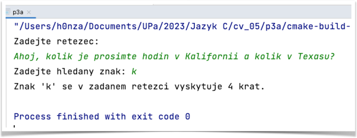

# Příklad 3
## četnost výskytu znaku v řetězci

Napište funkci, která vrací četnost požadovaného znaku v řetězci.
Hlavní program načte řetězec a hledaný znak.

**Modifikace:**
funkce vrací `void`, hodnotu četnosti obsahuje proměnná volaná „odkazem“.

